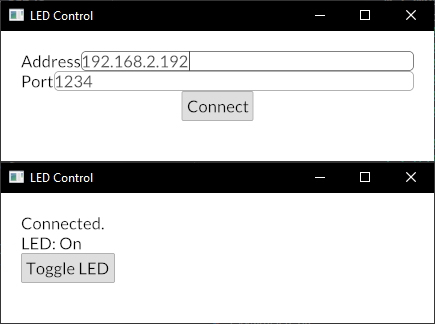

# LED/TCP

Just a silly little learning project to control an LED hooked up to a micro-controller
over a TCP connection.

The firmware written for the ESP32 connects to the provided WiFi access point and sets
up a TCP server on which it will listen to commands to toggle the LED.
To communicate with the MCU there is a desktop GUI application written in Rust
that allows the user to connect to the TCP server and press a button to issue commands to the MCU.

## Usage

### Firmware

Requirements: ESP32 MCU, VSCode + [ESP-IDF toolchain]

1. Open the `firmware/` sub-directory in VSCode
2. Set the ESP device target (use <kbd>Ctrl</kbd> <kbd>Shift</kbd> <kbd>P</kbd> to run commands in VSCode)
3. Run SDK configuration (<kbd>Ctrl</kbd> <kbd>E</kbd> <kbd>G</kbd>)
    1. Open the "LED over TCP Configuration" section
    2. Set WiFi SSID and password
    3. Set GPIO pin for LED
4. Set the port for the MCU (<kbd>Ctrl</kbd> <kbd>E</kbd> <kbd>P</kbd>)
5. Build, flash and monitor (<kbd>Ctrl</kbd> <kbd>E</kbd> <kbd>D</kbd>)

The IP address of the MCU will be available in the logs found in the monitor view.

[ESP-IDF toolchain]: https://docs.espressif.com/projects/esp-idf/en/latest/esp32/get-started/vscode-setup.html

### GUI

Requirements: [Rust/Cargo]

The control application can easily be built using `cargo`:

1. Move to the `gui/` sub-directory
2. Run `cargo r --release` to compile and run the application
3. Enter the MCU's IP and port of the TCP server
4. Toggle the LED using the button after connecting

The resulting binary can also be found at `gui/target/release/gui`.

[Rust/Cargo]: https://www.rust-lang.org/

## License

Licensed under the [MIT License](./LICENSE).
